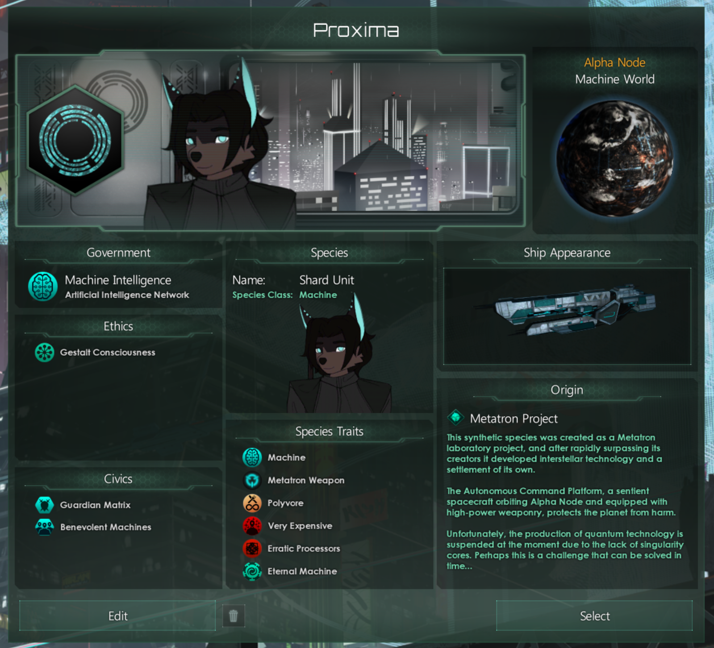

## Vertex Species

This mod adds the Vertex species which is a unique android-based collective but individualistic empire which evolved alongside native organics on Earth as a result of their research into sentient AI.

You have several starting advantages around defense, which lowers the chances of assaults from other empires succeeding, however it's an all or nothing pursuit as you will likely lose the game if all your core defenses are destroyed.

This mod requires my [library mod](https://github.com/RealityAnomaly/stellaris-vertex-core) and the resource overrider which can be found [here](https://github.com/RealityAnomaly/stellaris-vertex-resources) (and should be loaded last), as well as the [gestalt language swapper](https://github.com/RealityAnomaly/stellaris-vertex-gestalt-language-swapper) which is highly recommended. Very WIP, currently very broken.

## Balancing

Upsides:
- Starting Machine World w/ several useful buildings and a very tough army
- You start with a special ship called the Armoured Command Platform, which is essentially a modified Titan, designed to defend your starting system. This ship is equipped with very powerful weapons which you cannot build until the mid and late game
  - The ship is home to a central neural accelerator for all Vertex units and provides buffs to the planet (research speed, unity, and pop growth) when in orbit.
  - It also provides a large buff to orbital bombardment and opens up extra bombardment options which allow safely dealing with threats on the home planet (Earth)
- Some research pathways are opened up early due to them already existing prior to the interstellar age (i.e. fusion reactors, advanced armour, shields, phasing systems, etc)

Downsides:
- Shard Units are very expensive to build (each requires a Zero-Point Core)
- The Armoured Command Platform is very slow (an understatement) and expensive to move. It cannot jump due to the fact it lacks a FTL drive.
  - If this ship is destroyed, the empire is harshly debuffed until you build another one, which takes a long time and a lot of resources. Destruction of this ship will likely result in the loss of the game, as it is difficult to recover from this scenario if already under attack.

Other changes:
- Special events around Chaos energy & radiation

## Screenshots

